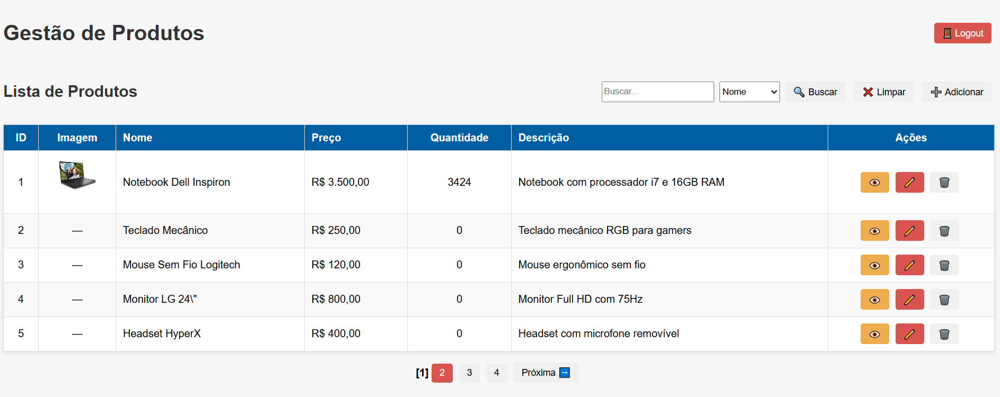
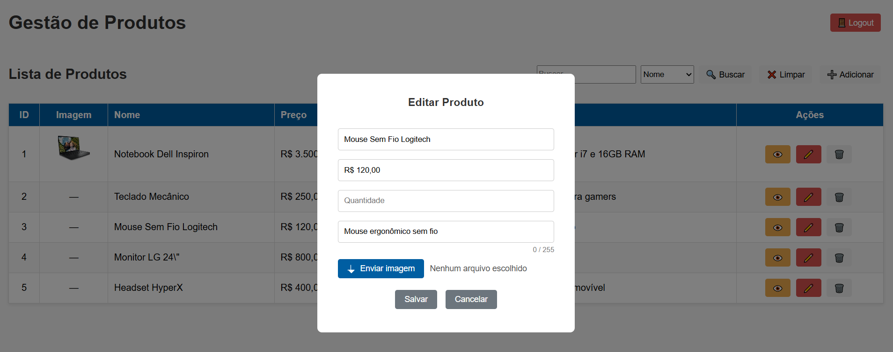
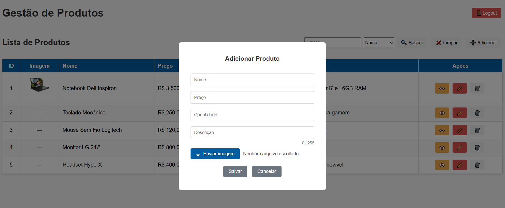
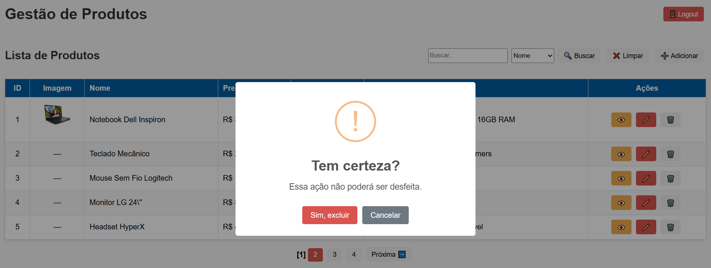
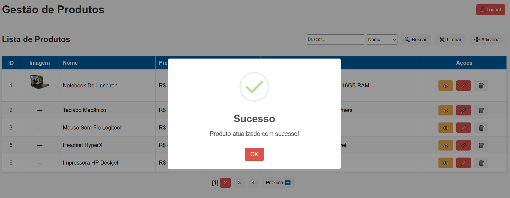
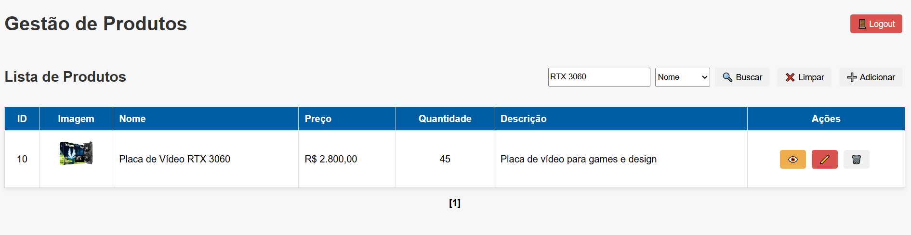
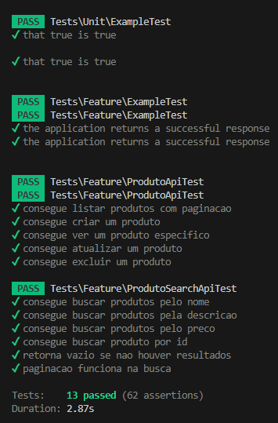

# 📦 APP_PRODUTOS – Sistema de Gestão de Produtos (Laravel + TypeScript + Docker)

Este projeto implementa um **sistema completo de gerenciamento de produtos**, desenvolvido em **Laravel (backend)** e **TypeScript (frontend)**, utilizando **Docker** para orquestração de ambiente.  

O objetivo principal foi atender a um **teste técnico** com foco em:  
- Boas práticas de código.  
- Arquitetura limpa (Controller → Service → Request).  
- Validações robustas no frontend e backend.  
- Autenticação e autorização segura (Laravel Sanctum + Gates).  
- Upload de imagens com hash, restrições de formato e tamanho.  

---

## 🚀 Estrutura do Projeto

```
COT_MERCADO/
├── .github/
│   └── workflows/
│       └── ci-cd.yml                # Pipeline de CI/CD que faz build, push e deploy automático da aplicação via GitHub Actions.
│
├── backend/                         # Diretório principal do backend (API Laravel)
│   ├── app/
│   │   ├── Console/
│   │   │   ├── Commands/
│   │   │   │   ├── CreateDatabase.php        # Comando Artisan customizado para criar banco de dados via terminal.
│   │   │   │   └── ResetTestDatabase.php     # Comando Artisan para resetar o banco de testes automatizados.
│   │   │   └── Kernel.php                   # Registra os comandos Artisan e agendamentos do sistema.
│   │   │
│   │   ├── Exceptions/
│   │   │   └── Handler.php                  # Manipula exceções e erros globais da aplicação.
│   │   │
│   │   ├── Http/
│   │   │   ├── Controllers/
│   │   │   │   ├── ProdutoController.php    # Controla as operações CRUD de produtos (listar, criar, editar, excluir, buscar).
│   │   │   │   └── AuthController.php       # Gerencia login/logout e autenticação de usuários via Laravel Sanctum.
│   │   │   ├── Middleware/
│   │   │   │   └── Authenticate.php         # Middleware que intercepta requisições protegidas e valida o token Sanctum.
│   │   │   ├── Requests/
│   │   │   │   ├── ProdutoStoreRequest.php  # Define as regras de validação ao criar um produto.
│   │   │   │   └── ProdutoUpdateRequest.php # Define as regras de validação ao atualizar um produto.
│   │   │   └── Kernel.php                   # Registra middlewares e grupos de rotas (web, api, sanctum etc).
│   │   │
│   │   ├── Models/
│   │   │   ├── Produto.php                  # Model principal que representa a tabela `produtos` e suas relações.
│   │   │   ├── ProdutoImage.php             # Model das imagens dos produtos, vinculado via relação `hasMany`.
│   │   │   └── User.php                     # Model do usuário com autenticação via Sanctum.
│   │   │
│   │   ├── Providers/
│   │   │   ├── AppServiceProvider.php       # Registra serviços e configurações globais.
│   │   │   ├── AuthServiceProvider.php      # Registra as policies e gates de autorização.
│   │   │   └── RouteServiceProvider.php     # Define o carregamento das rotas web e API.
│   │   │
│   │   └── Services/
│   │       └── ProdutoService.php           # Camada de serviço responsável pela regra de negócio dos produtos (CRUD + upload).
│   │
│   ├── bootstrap/
│   │   └── app.php                          # Inicializa a aplicação Laravel (configuração base do framework).
│   │
│   ├── config/
│   │   ├── app.php                          # Configurações principais (timezone, providers, locale, etc.).
│   │   ├── auth.php                         # Configurações de autenticação (guards, providers, passwords).
│   │   ├── database.php                     # Configurações do banco de dados (MySQL, SQLite, etc.).
│   │   ├── filesystems.php                  # Configurações de armazenamento (local, public, s3, etc.).
│   │   ├── logging.php                      # Configurações de logs (canal stack, daily, etc.).
│   │   ├── sanctum.php                      # Configuração específica do Laravel Sanctum.
│   │   └── services.php                     # Integrações externas (e-mail, API keys, etc.).
│   │
│   ├── database/
│   │   ├── factories/
│   │   │   ├── ProdutoFactory.php           # Gera produtos fake para testes e seeders.
│   │   │   └── UserFactory.php              # Gera usuários fake para testes e autenticação.
│   │   │
│   │   ├── migrations/
│   │   │   ├── 0001_01_01_000000_create_users_table.php   # Cria a tabela de usuários.
│   │   │   ├── 0001_01_01_000001_create_cache_table.php   # Cria a tabela de cache.
│   │   │   ├── 2025_09_25_180407_create_produtos_table.php # Cria a tabela de produtos.
│   │   │   ├── 2025_09_28_135927_create_produto_images_table.php # Cria a tabela de imagens dos produtos.
│   │   │   └── (... demais migrations ...)   # Outras migrations automáticas do Laravel.
│   │   │
│   │   ├── seeders/
│   │   │   ├── DatabaseSeeder.php           # Roda todos os seeders de forma centralizada.
│   │   │   └── ProdutoSeeder.php            # Insere dados fake iniciais na tabela `produtos`.
│   │   │
│   │   └── database.sqlite                  # Banco de dados SQLite usado apenas em ambiente de testes.
│   │
│   ├── public/
│   │   ├── img/                             # Diretório público onde ficam armazenadas as imagens enviadas.
│   │   ├── index.php                        # Ponto de entrada HTTP do Laravel.
│   │   └── .htaccess                        # Regras de reescrita de URL para Apache.
│   │
│   ├── resources/
│   │   └── views/
│   │       └── welcome.blade.php            # Página inicial padrão do Laravel (não utilizada no projeto principal).
│   │
│   ├── routes/
│   │   ├── api.php                          # Define as rotas da API (produtos, autenticação, upload, etc.).
│   │   └── web.php                          # Define as rotas web básicas.
│   │
│   ├── storage/
│   │   ├── app/public/img/                  # Diretório de armazenamento dos uploads de produtos.
│   │   ├── framework/                       # Cache interno do Laravel.
│   │   └── logs/                            # Arquivos de log da aplicação.
│   │
│   ├── tests/
│   │   ├── Feature/
│   │   │   ├── ProdutoApiTest.php           # Testa o CRUD completo de produtos (listar, criar, editar, excluir).
│   │   │   ├── ProdutoSearchApiTest.php     # Testa o sistema de busca e paginação de produtos.
│   │   │   └── ExampleTest.php              # Teste padrão de exemplo do Laravel.
│   │   └── Unit/
│   │       └── ExampleTest.php              # Teste unitário básico (exemplo de validação).
│   │
│   ├── artisan                              # CLI do Laravel (executa comandos, migrations, seeds, testes, etc.).
│   ├── composer.json                        # Dependências PHP do projeto e scripts do Composer.
│   ├── composer.lock                        # Versões exatas das dependências instaladas.
│   ├── phpunit.xml                          # Configuração dos testes PHPUnit.
│   ├── .env                                 # Arquivo de variáveis de ambiente (DB, APP_KEY, etc.).
│   ├── .env.example                         # Exemplo do arquivo `.env`.
│   └── README.md                            # Documentação interna do backend.
│
├── frontend/                                # Aplicação frontend escrita em TypeScript + Vite
│   ├── src/
│   │   ├── api.ts                           # Configura o Axios para comunicação com o backend e define headers do token.
│   │   ├── pages/
│   │   │   ├── produtos.ts                  # Implementa o CRUD completo (listar, criar, editar, excluir, buscar produtos).
│   │   │   └── login.ts                     # Tela de login, integração com AuthController e controle de token Sanctum.
│   │   ├── css/
│   │   │   └── style.css                    # Estilos visuais principais da aplicação (tabela, botões, modais).
│   │   ├── index.html                       # Página HTML principal (renderiza o app TypeScript).
│   │   ├── index.ts                         # Ponto de entrada do app, inicializa o login e carrega a página de produtos.
│   │   └── utils.ts                         # Funções auxiliares reutilizáveis (formatação, alertas, etc.).
│   │
│   ├── tsconfig.json                        # Configuração do compilador TypeScript.
│   ├── vite.config.js                       # Configurações de build e servidor local do Vite.
│   ├── package.json                         # Dependências e scripts npm.
│   ├── package-lock.json                    # Versões exatas das dependências npm.
│   ├── .env                                 # Variáveis de ambiente do frontend (URL da API, modo DEV/PROD).
│   └── README.md                            # Documentação interna do frontend.
│
├── docker-compose.yml                       # Orquestra containers do backend, frontend e banco MySQL.
├── Dockerfile.backend                       # Define o build do container Laravel (Composer, PHP 8.2, etc.).
├── Dockerfile.frontend                      # Define o build do container Vite/TypeScript.
├── backend-entrypoint.sh                    # Script de inicialização do backend (migrações, storage link, etc.).
├── frontend-entrypoint.sh                   # Script de inicialização do frontend (npm install + vite).
└── README.md                                # Documentação principal do projeto (instalação, uso e screenshots).
├── imagens/                                 # ← 📁 pasta criada para imagens usadas no README

```
---

## 🔑 Funcionalidades Implementadas

### ✅ CRUD de Produtos
- Listagem paginada com busca e filtro (ID, nome, preço, quantidade, descrição).  
- Criar, editar e excluir produtos.  
- Validações robustas (preço não pode ser negativo, quantidade não pode ser negativa).  
- Upload de imagem por produto:
  - Hash único gerado no backend.
  - Restrição de 10MB.
  - Apenas formatos **JPEG, PNG, WEBP**.
  - Armazenamento em `storage/app/public/img/`.
  - Exibição via `/img/{hash.ext}` (Laravel `storage:link`).  

### 🔐 Autenticação e Autorização
- Login com email/senha via **Laravel Sanctum**.  
- Token salvo no `localStorage` (frontend).  
- Todas as rotas de produtos protegidas.  
- Permissões via **Gates**:
  - `manage-produtos`: apenas **admin/editor** podem criar/editar.  
  - `delete-produtos`: apenas **admin** pode excluir.  
- Logs detalhados de todas as operações (quem criou, atualizou, tentou excluir sem permissão).  

### ⚙️ Arquitetura Limpa
- **Controller**: apenas orquestra requests/responses.  
- **Service**: concentra regra de negócio (CRUD + upload).  
- **Request**: validação centralizada (`ProdutoStoreRequest` / `ProdutoUpdateRequest`).  
- **Model**: `Produto` (com relação `hasMany` para `ProdutoImage`).  

### 🖼️ Imagens
- Relacionamento **1 Produto → N Imagens**.  
- Evita duplicação com hash (`sha1_file`).  
- Se tentar enviar a mesma imagem, retorna:  


### Suba os containers

- 🚀 Script de Instalação da Base com Docker
Este script automatiza a configuração inicial de um servidor Ubuntu Server 24.04 LTS, incluindo:

- Atualização completa do sistema
- Definição do fuso horário (America/Sao_Paulo)
- Instalação da versão mais recente do Docker e dependências
- Habilitação dos serviços Docker e containerd para inicialização automática
- Verificação automática se o Docker já está instalado (evita reinstalação)
- Geração opcional de chave SSH RSA 2048 bits para uso em pipelines de CI/CD


Executar remotamente via curl (sem baixar o arquivo)
Copie a linha abaixo e execute diretamente o comando no seu terminal:

```
  curl -sSL https://raw.githubusercontent.com/LegionarioBq/DevOps/main/install_base_docker.sh | bash

```
OU

```
  wget -qO- https://raw.githubusercontent.com/LegionarioBq/DevOps/main/install_base_docker.sh | bash

```

No terminal WSL
- abre o diretorio da aplicação.

```
  docker-compose down -v
  docker-compose build --no-cache
  docker-compose up -d

```
🧰 Comandos Docker Úteis
Acessar containers manualmente

```
  docker exec -it app_produtos_mysql bash
  docker exec -it app_produtos_back bash
  docker exec -it app_produtos_front sh

```
  Rodar testes dentro do container do backend

```
  docker exec -it app_produtos_back php artisan test

```

2. Configure o backend

 - cd backend
 - cp .env.example .env
 - php artisan key:generate
 - php artisan migrate --seed
 - php artisan storage:link

3. Configure o frontend

 - cd frontend
 - cp .env.example .env
 - npm install
 - npm run dev

4. Acesse no navegador

API Laravel → http://127.0.0.1:8000/api

Frontend TypeScript → http://127.0.0.1:3000

PhpMyAdmin → http://localhost:8082

<br>
🧪 Testes Automatizados
Criar banco de testes

```
  php artisan db:create mercprodutos_test

```

Resetar banco de testes

```
  php artisan db:reset-test

```

Rodar migrations no banco de teste

```
  php artisan migrate --env=testing

```

Executar testes

```
  php artisan test

```

Separação clara de bancos:

mercprodutos → produção/desenvolvimento.

mercprodutos_test → ambiente de testes.

<br><br>
📜 Fluxo Completo de Autenticação

Usuário acessa tela de login (frontend).

Envia email + password para /api/login.

Backend valida e gera Sanctum Token.

Frontend salva token no localStorage.

Todas as requisições API enviam Authorization: Bearer {token}.

Sanctum valida → se ok → Controller executa.

Gates verificam permissões antes de ações críticas.

<br>
🖥️ Demonstração do Frontend

- Listagem com paginação.

- Busca com filtro dinâmico.

- Modal para criar/editar produtos com upload de imagem.

- Modal de visualização com preview da imagem e descrição.

🖥️ Interface do Sistema <br>

### Tela principal
<p align="center">
  
</p>

### Tela de detalhes
<p align="center">
  
</p>

### Tela de edição
<p align="center">
  
</p>

### Tela de criação
<p align="center">
  
</p>

### Confirmação de exclusão
<p align="center">
  
</p>

### Sucesso na atualização
<p align="center">
  
</p>

### Busca de produto específica
<p align="center">
  
</p>


<br>

## 🧪 Testes Automatizados

<p align="center">
  
</p>

Todos os **13 testes** passaram com sucesso ✅  
Incluindo **CRUD**, **buscas**, **autenticação Sanctum** e **validações**.


<br>
✨ Diferenciais Implementados

Uso de SOLID (separação Controller/Service/Request).

Upload de imagens com hash único.

Logs para auditoria.

Frontend TypeScript com integração direta via Axios.

Paginação e busca em tempo real.

Pipeline CI/CD pronto (.github/workflows/ci-cd.yml).


<br>
📖 Requisitos Originais do Teste Técnico

Este projeto foi desenvolvido seguindo integralmente os requisitos funcionais, diferenciais e extras do teste técnico, incluindo:

Docker

CRUD + Autenticação

API RESTful protegida

Validações (frontend + backend)

Upload de imagens

Arquitetura limpa + SOLID

Testes automatizados

Controle de permissões

<br>
✅ Conclusão

O sistema APP_PRODUTOS é uma aplicação web robusta, escalável e bem estruturada, que combina as melhores práticas de Laravel, TypeScript e Docker.

Ele está pronto para ser expandido com novas funcionalidades (ex: filtros avançados, relatórios, integração com APIs externas) mantendo a arquitetura limpa e testável.


